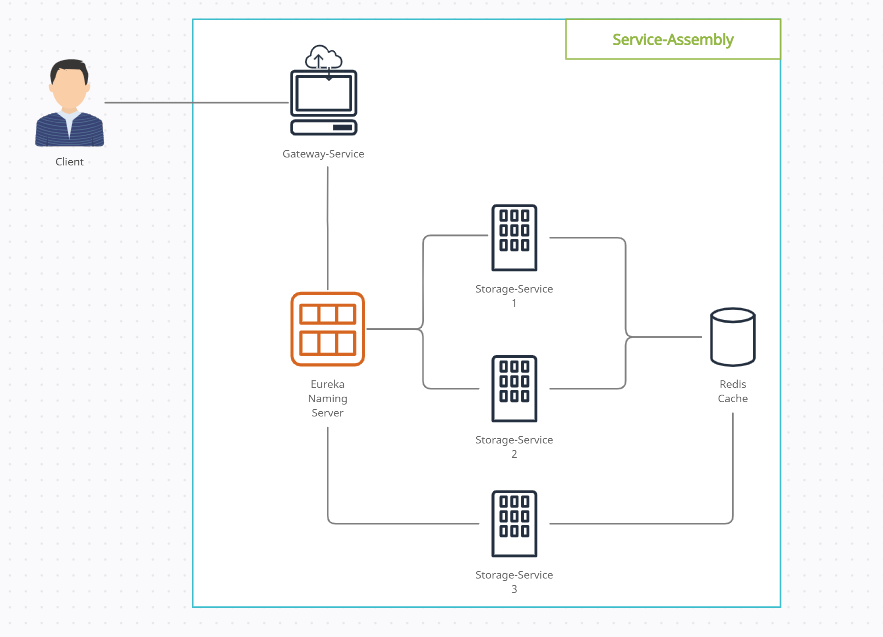
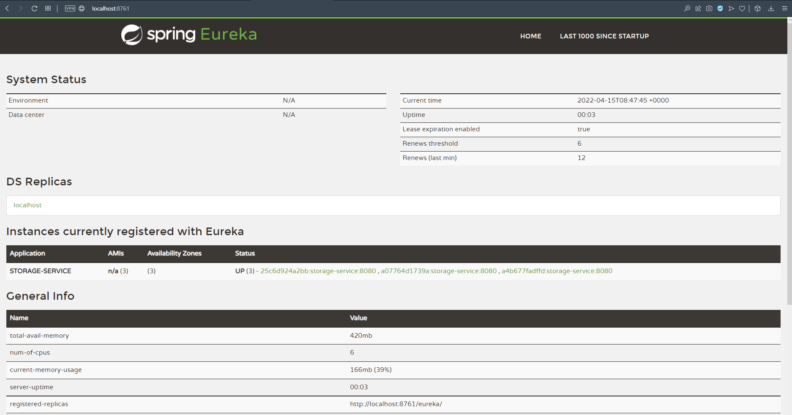

# KX Problem solving exercise

## Problem
We would like you to implement a distributed **Service Assembly** with a gateway component.

## Description
The service assembly will have the following components:
1) **Storage Service** - stores in-memory, dummy data that can be accessed through a REST GET call in JSON format
2) **Gateway Service** - main process that serves data to clients and tracks the availability of the Storage Services (there could be 0 to 3 available) and has the following REST endpoints
    * **/status** - returns the status of each Storage Service
    * **/data** - fetches the dummy data from a Storage Service (eg. with round robin) and returns the data in JSON format

We would like the services to be containerised and run with docker-compose.
The services can be implemented using any programming language.

## Architecture


## Proposed Solution

I came up with a **Spring Boot** based solution with **Redis Cache** and **Eureka** naming server. 
I implemented the core logic in **Storage Service** with an extension of Eureka service discovery - it means once a new node launches it registers itself to the naming server.
With this solution if user wants to query the _/data_ endpoint the **Gateway Service** can ask the Eureka naming server about the available nodes and forward request based on the real-time availability.




## Requirements

For building and running the application you need install:
- [JDK 11](https://www.oracle.com/java/technologies/downloads/#java11)
- [Maven 3](https://maven.apache.org)
- [Docker](https://docs.docker.com/get-docker/)
- [Docker Compose](https://docs.docker.com/compose/install/)

After the successful installation step you need to navigate to the docker folder of this project and run the following command:
```shell
docker-compose up --build
```

After some time you will be able to check the Eureka naming server page to validate the registered **Storage Service** nodes.


Once the validation is done you can hit the /get API using **http://localhost:8000/get** and the response will be in JSON format something like this:

```json
[
   {
      "name": "Willie Rippin",
      "address": "0367 Jerrell Forest",
      "sex": "Male",
      "phoneNumber": "1-666-114-0865 x1036",
      "position": "Orchestrator",
      "title": "Global IT Manager"
   },
   {
      "name": "Fernando Schaefer",
      "address": "4789 Lubowitz Plain",
      "sex": "Female",
      "phoneNumber": "401.584.1765 x62698",
      "position": "Director",
      "title": "Marketing Specialist"
   },
   {
      "name": "Aurore O'Reilly",
      "address": "10707 McLaughlin Pike",
      "sex": "Male",
      "phoneNumber": "804.140.8256 x5375",
      "position": "Director",
      "title": "Manufacturing Administrator"
   }
]
```

Finally, you can query the available nodes using /status API **http://localhost:8000/status**:
```json
{
   "availableNodes": [
      {
         "appName": "STORAGE-SERVICE",
         "instanceId": "a07764d1739a:storage-service:8080",
         "hostname": "a07764d1739a",
         "status": "UP"
      },
      {
         "appName": "STORAGE-SERVICE",
         "instanceId": "a4b677fadffd:storage-service:8080",
         "hostname": "a4b677fadffd",
         "status": "UP"
      },
      {
         "appName": "STORAGE-SERVICE",
         "instanceId": "25c6d924a2bb:storage-service:8080",
         "hostname": "25c6d924a2bb",
         "status": "UP"
      }
   ]
}
```

## Acceptance Criteria Question
* _What should the Gateway do if no Storage Services are running?_

Maybe I am wrong, but based on my current knowledge the gateway service is not responsible for maintaining 
the available nodes as we would like to build loosely coupled architecture. 
Based on my understanding the gateway has a responsibility to 
forward the request from the outside world and hide the underlying complexity.

Rather I would prefer to use a monitoring tools like Kubernetes Grafana or Azure Monitor or Amazon CloudWatch.